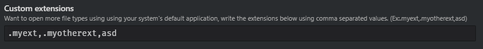

# **Starbound Modding Suite**: Open Unsupported Files
This plugin allows atom to open specific "unsupported" file types using your
system's default application for that file type.

# Usage
To open a file externally, simply double click on the item in the project pane.  

# Configuration
By default the plugin declares a list of known extensions that can be opened
externally. You may disable the behaviour for these default filetypes using the
toggles available in the plugin's configuration.  

To mark more filetypes as "unsupported" you can write them in the "Custom extensions"
section using comma separated values. (Eg:.myext,.myotherext,asd)  

## Unofficial Starbound Modding suite
This package is part of the starbound modding package suite for atom, all plugins
are maintained and modified by [C0bra5](https://atom.io/users/C0bra5).